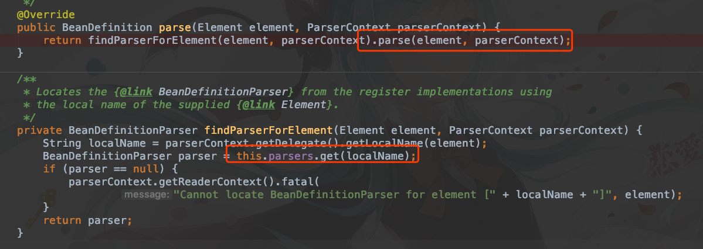
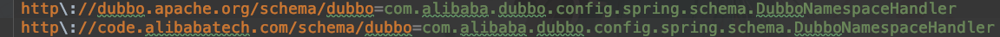

# Dubbo 如何解析配置文件

## 一、为什么可以这么做

首先看接口 ``org.springframework.beans.factory.xml.BeanDefinitionParser``

```java
public interface BeanDefinitionParser {
	BeanDefinition parse(Element element, ParserContext parserContext);
}
```
``DubboBeanDefinitionParser`` 实现这个接口，就可以把 XML  转换成 BeanDefinition


## 二、是谁在这么做

``org.springframework.beans.factory.xml.BeanDefinitionParserDelegate#parseCustomElement``


看这个方法，很容易知道首先会从 namespace 中的 uri 解析出来需要解析的 Handler，然后通过这个 Handler 调用 parse 方法，NamespaceHandler 是 Spring 提供的接口，而 DubboNamespacHandler 则是提供具体的实现，用来实现特定的标签。

```java
public interface NamespaceHandler {

   void init();

   BeanDefinition parse(Element element, ParserContext parserContext);
  
   BeanDefinitionHolder decorate(Node source, BeanDefinitionHolder definition, ParserContext parserContext);

}
```

```java
public class DubboNamespaceHandler extends NamespaceHandlerSupport {

    static {
        Version.checkDuplicate(DubboNamespaceHandler.class);
    }

    @Override
    public void init() {
        registerBeanDefinitionParser("application", new DubboBeanDefinitionParser(ApplicationConfig.class, true));
        registerBeanDefinitionParser("module", new DubboBeanDefinitionParser(ModuleConfig.class, true));
        registerBeanDefinitionParser("registry", new DubboBeanDefinitionParser(RegistryConfig.class, true));
        registerBeanDefinitionParser("monitor", new DubboBeanDefinitionParser(MonitorConfig.class, true));
        registerBeanDefinitionParser("provider", new DubboBeanDefinitionParser(ProviderConfig.class, true));
        registerBeanDefinitionParser("consumer", new DubboBeanDefinitionParser(ConsumerConfig.class, true));
        registerBeanDefinitionParser("protocol", new DubboBeanDefinitionParser(ProtocolConfig.class, true));
        registerBeanDefinitionParser("service", new DubboBeanDefinitionParser(ServiceBean.class, true));
        registerBeanDefinitionParser("reference", new DubboBeanDefinitionParser(ReferenceBean.class, false));
        registerBeanDefinitionParser("annotation", new AnnotationBeanDefinitionParser());
    }

}
```

可以看到，DubboNamespaceHandler -> NamespaceHandlerSupport -> NamespaceHandler

具体的解析的流程是 ``NamespaceHandlerSupport`` 去安排



又回到刚开始提到了 ``DubboBeanDefinitionParser`` 中解析。

## 三、额外话——如何通过 namespace 找到 handler

在``META-INF/spring.handlers``中声明了 Handler 中的映射，故可以找到特定类



## 四、parse

在具体 parse 的时候，会有以下的几个方法，分别解析不同的内容

* ``parseProperties``
* ``parseNested``
* parseParameters
* ``parseMethods``
* ``parseMultiRef``


## 五、总结

**重要的是整个流程下来，主要运用到了设计模式的模板模式以及OOP思想，把读取配置，封装成 BeanDefinition，供 IoC 调取**

