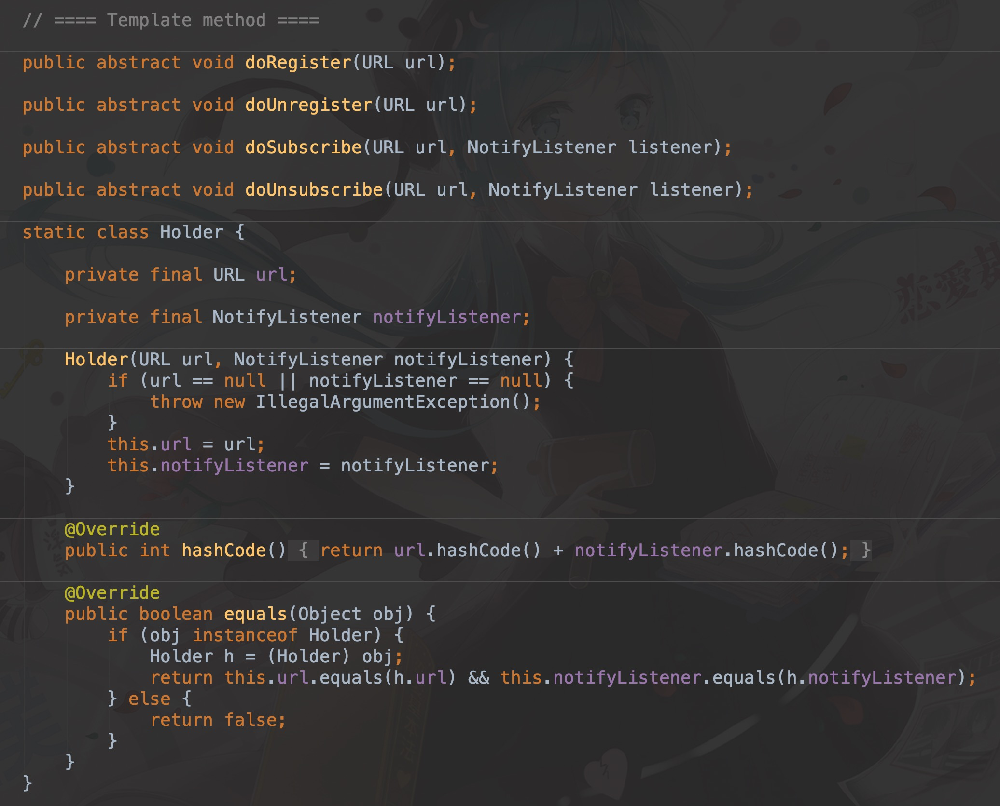
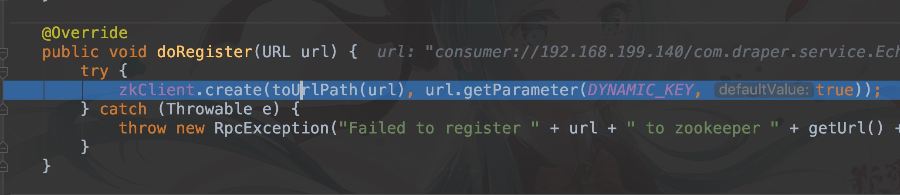

# ZooKeeper 简介

Zookeeper 是树形结构的注册中心，每个节点的类型分为持久节点、持久顺序节点、临时节点和临时顺序节点。

Dubbo 使用 ZooKeeper 作为注册中心时，智慧创建持久节点和临时节点两种，对创建的顺序没有要求

在使用 Dubbo 中的 ZooKeeper 注册中心的核心类是 ``ZookeeperRegistry``

ZooKeeperRegistry 继承 ``FailbackRegistry`` ，后者又继承了 ``AbstractRegistry``，实现了 ``Registry`` 接口。其核心接口有四个，在 FailbackRegistry 中，专门留有模板方法

而 ZooKeeperRegistry 就是实现了其中的细节

## 一、doRegister

consumer://192.168.199.140/com.draper.service.EchoService?application=EchoClient&category=consumers&check=false&dubbo=2.0.2&interface=com.draper.service.EchoService&lazy=false&methods=echo&pid=31471&qos.enable=false&release=2.7.3&side=consumer&sticky=false&timestamp=1568466180359

zkClient 选择是否创建一个短暂的客户端

## 二、doSubscribe

``org.apache.dubbo.registry.zookeeper.ZookeeperRegistry#doSubscribe``

存储 cache，接收 notify url 信息

## 三、doUnSubscribe

## 四、doUnRegister

