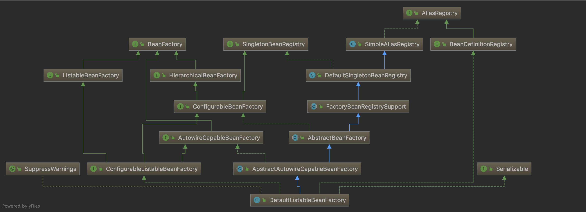
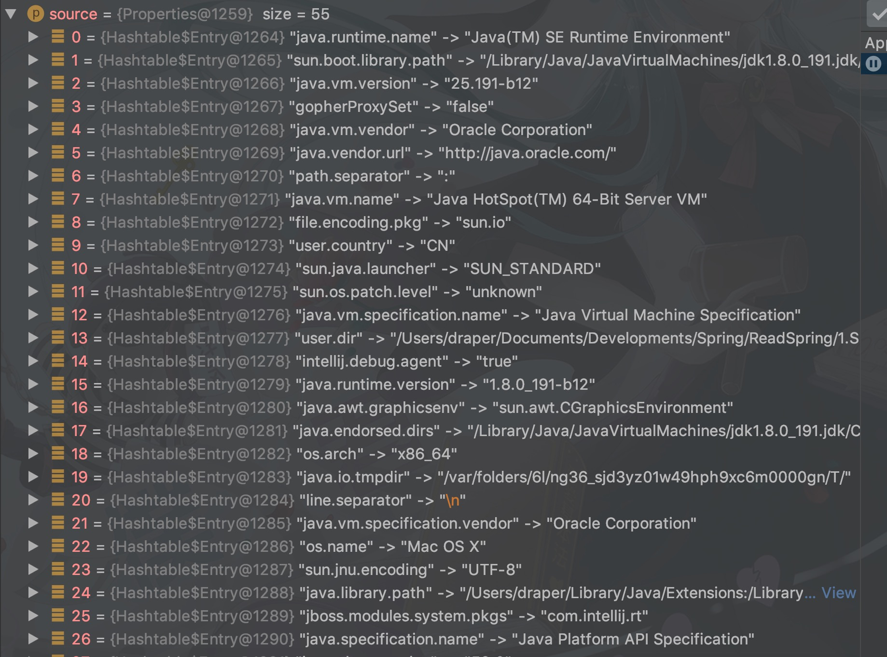
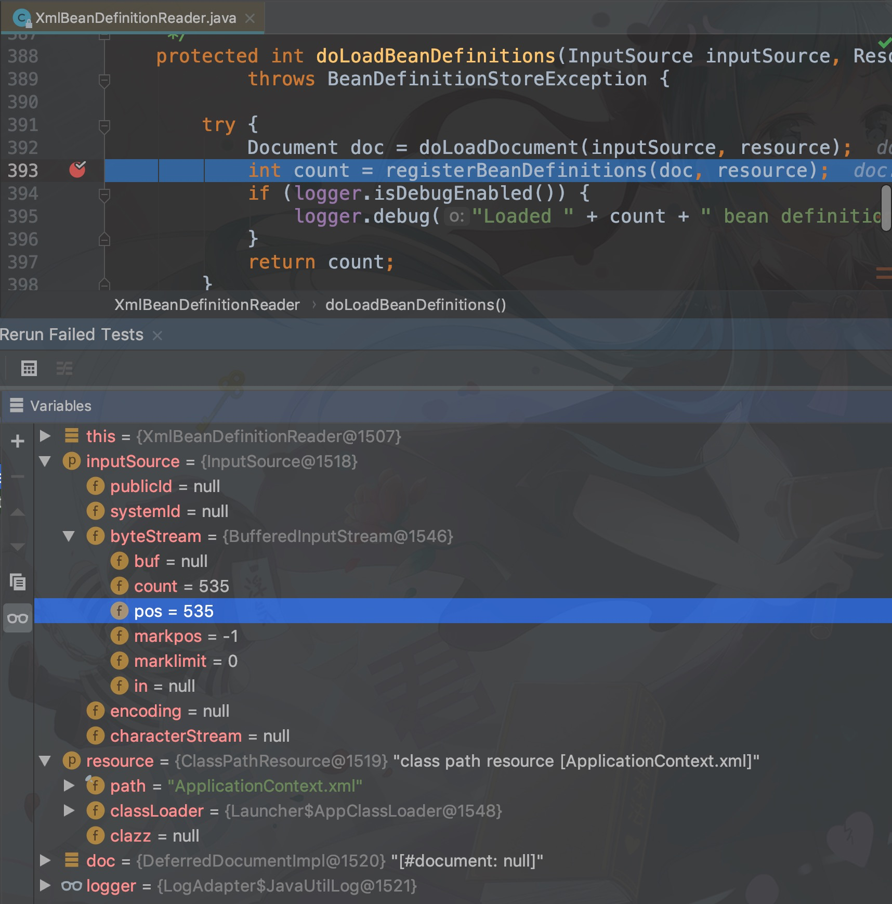
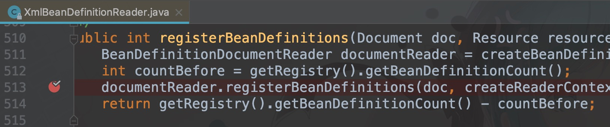
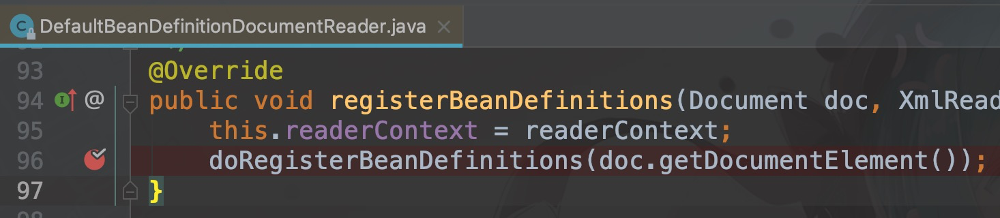
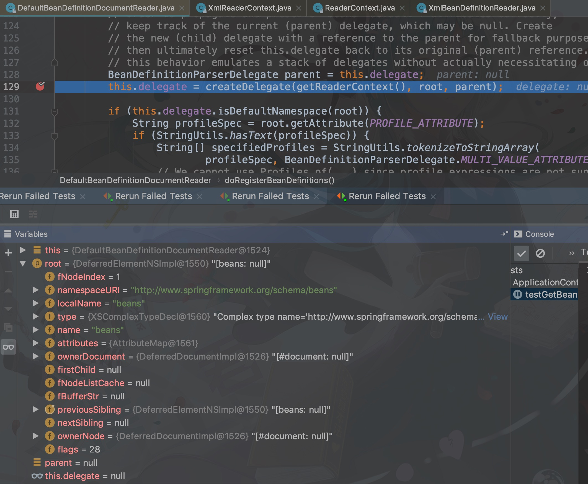
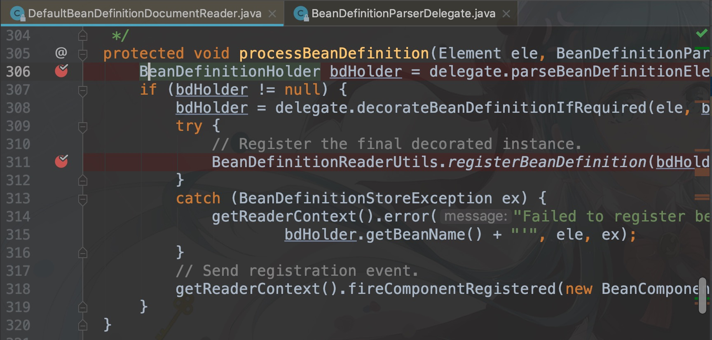
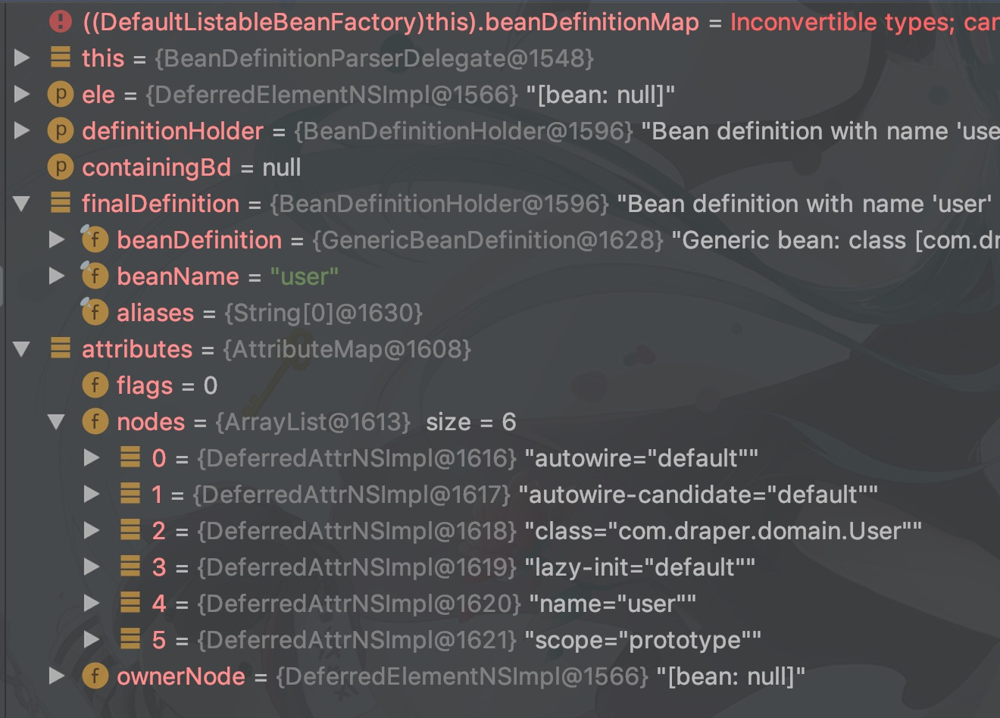
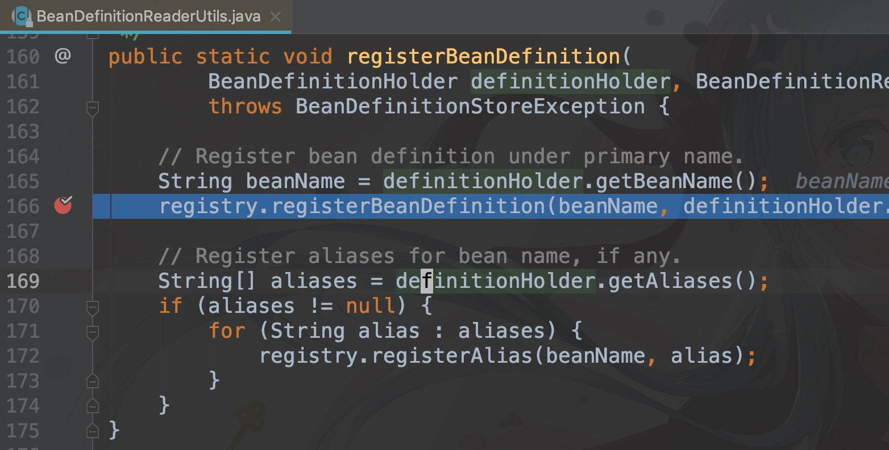

``Type Hierarchy`` - 键入层次结构


## IoC - Inversion of Control

控制反转，将对象的控制权利从我们人为的手中交给容器去解决，其中最重要的一点就是解决程序，类之间的耦合，换句话说就是避免长的调用链或无意义的封装。

> 在一个类中需要使用一个对象，而这个对象通常是作为参数被传进来的，我们需要修改接口，修改实现类…很麻烦，我要继续修改回去也是一样。并且往往在很多封装情况下，找不到我们真正需要的对象，我们可以根据 beanname 

容器进行对象生命周期管理，可以很合理注入到我们需要的地方。


## DI - Dependency Injection

依赖注入，从 IoC 中我们可以很容易的对对象的生命周期进行管理，但是在我们需要对象的时候，就需要容器来为我们提供。


所以说，IoC 具备理论意义，而 DI 则是实际实现。把复杂对象注入到我们需要的地方


DI 技术在 Java 的实现是 动态代理 以及 字节码代理


## 走一遍 IoC 容器的创建

**如果没有使用电脑进行 debug，这篇笔记看了也没用，有些内容因为 debug 直接跳过了，最好自己走一遍**

* Spring Version: 5.1.4.RELEASE

* IoC 创建方式：见下代码 6 - 8 行

```java
@Test
public void testGetBean() {
    ResourcePatternResolver resolver = new PathMatchingResourcePatternResolver();
    Resource resource = resolver.getResource("classpath:ApplicationContext.xml");
  
    DefaultListableBeanFactory factory = new DefaultListableBeanFactory();
    XmlBeanDefinitionReader reader = new XmlBeanDefinitionReader(factory);
    reader.loadBeanDefinitions(resource);
  
    System.out.println("init BeanFactory");
    User user = factory.getBean("user", User.class);
    System.out.println("user bean is ready for use");
}
```


看一下我们创建 Bean 的 Factory 在 Spring IoC 中的地位




简单介绍下各个类

* ``AliasRegistry`` - 接口，一些 register 、remove、is 方法声明
* ``SimpleAliasRegistry`` - 提供 Alias register 的实现
* **``DefaultSingletonBeanRegistry``** - ==内部包含多个集合对象，用作容器==，实现一些 shared bean 注册中心
* ``FactoryBeanRegistrySupport``  - 用作对单例注册中心的支持
* **``AbstractBeanFactory``** - 是 ``BeanFactory`` 的实现，提供了 full capabilities，例如 Slngleton 的缓存等
* ``AbstractAutowireCapableBeanFactory``
* ``DefaultListableBeanFactory`` 列出可用的 Bean，顶级接口只能获取一个，这个容器可以获取多个 Bean


### 初始化 Factory，即注册中心

```java
XmlBeanDefinitionReader reader = new XmlBeanDefinitionReader(factory);
```

使用 DefaultListableBeanFactory 来获取 Xml 文件中 Bean 的 Reader，然后通过 reader 去加载我们的 xml 文件，来实例化 bean

试着 debug 可以看见一个方法

```java
protected AbstractBeanDefinitionReader(BeanDefinitionRegistry registry) {
	this.registry = registry;
	if (this.registry instanceof ResourceLoader) {
		this.resourceLoader = (ResourceLoader) this.registry;
	} else {
		this.resourceLoader = new PathMatchingResourcePatternResolver();
	}
  if (this.registry instanceof EnvironmentCapable) {
		this.environment = ((EnvironmentCapable) this.registry).getEnvironment();
	} else {
		this.environment = new StandardEnvironment();
	}
}
```


注意第 6 行， ``PathMatchingResourcePatternResolver`` 有两个作用

* 提供一个资源路径匹配，``AntMatcher``

* 提供一个 DefaultResourceLoader 主要获取了一个 ClassUtil 下的 DefaultClassLoader

注意第 11 行， 

* ``StandardEnvironment`` ，负责加载操作系统的 Properties 和 Environment

  > ```org.springframework.core.env.AbstractEnvironment#getSystemProperties`` 这个方法将会获取一些列系统资源，如下图，很容易通过名字判断
  >
  > 
  >
  > 

---


### 读取 xml 文件

```java
reader.loadBeanDefinitions(resource);
```

算一下我们现在有了什么，**我们现在有一个创建 Bean 的 Factory，还有一个资源 Reader，**其实我比较在意到底在什么时候创建 Bean

```java
public int loadBeanDefinitions(EncodedResource encodedResource) throws BeanDef
	Assert.notNull(encodedResource, "EncodedResource must not be null");
	if (logger.isTraceEnabled()) {
		logger.trace("Loading XML bean definitions from " + encodedResource);
	}
	Set<EncodedResource> currentResources = this.resourcesCurrentlyBeingLoaded
	if (currentResources == null) {
		currentResources = new HashSet<>(4);
		this.resourcesCurrentlyBeingLoaded.set(currentResources);
	}
	if (!currentResources.add(encodedResource)) {
		throw new BeanDefinitionStoreException(
				"Detected cyclic loading of " + encodedResource + " - check yo
	}
	try {
		InputStream inputStream = encodedResource.getResource().getInputStream
		try {
			InputSource inputSource = new InputSource(inputStream);
			if (encodedResource.getEncoding() != null) {
				inputSource.setEncoding(encodedResource.getEncoding());
			}
			return doLoadBeanDefinitions(inputSource, encodedResource.getResou
		}
		finally {
			inputStream.close();
		}
	}
	catch (IOException ex) {
		throw new BeanDefinitionStoreException(
				"IOException parsing XML document from " + encodedResource.get
	}
	finally {
		currentResources.remove(encodedResource);
		if (currentResources.isEmpty()) {
			this.resourcesCurrentlyBeingLoaded.remove();
		}
	}
}
```

这个方法直接定位到第 22 行，进入 doLoadBeanDefinitions，详细方法见下



可以看到**根据一个字节流和我们的文件路径开始向 BeanFactory 注册(registerBeanDefinitions)我们的 Bean ** 


---

接下来的 debug 比较乱，emmm，核心思路就是解析 xml 文件，debug 过程如下



重点看下 513 行，再次进入方法



接下来第 97 行，其中 debug 代码如下



确实在我们的 xml 文件中读取

```java
protected void doRegisterBeanDefinitions(Element root) {
   // Any nested <beans> elements will cause recursion in this method. In
   // order to propagate and preserve <beans> default-* attributes correctly,
   // keep track of the current (parent) delegate, which may be null. Create
   // the new (child) delegate with a reference to the parent for fallback purposes,
   // then ultimately reset this.delegate back to its original (parent) reference.
   // this behavior emulates a stack of delegates without actually necessitating one.
   BeanDefinitionParserDelegate parent = this.delegate;
   this.delegate = createDelegate(getReaderContext(), root, parent);

   if (this.delegate.isDefaultNamespace(root)) {
      String profileSpec = root.getAttribute(PROFILE_ATTRIBUTE);
      if (StringUtils.hasText(profileSpec)) {
         String[] specifiedProfiles = StringUtils.tokenizeToStringArray(
               profileSpec, BeanDefinitionParserDelegate.MULTI_VALUE_ATTRIBUTE_DELIMITERS);
         // We cannot use Profiles.of(...) since profile expressions are not supported
         // in XML config. See SPR-12458 for details.
         if (!getReaderContext().getEnvironment().acceptsProfiles(specifiedProfiles)) {
            if (logger.isDebugEnabled()) {
               logger.debug("Skipped XML bean definition file due to specified profiles [" + profileSpec +
                     "] not matching: " + getReaderContext().getResource());
            }
            return;
         }
      }
   }

   preProcessXml(root);
   parseBeanDefinitions(root, this.delegate);
   postProcessXml(root);

   this.delegate = parent;
}
```


28 和 30 行代码均为前置和后置，最重要的是 29 行，在这里面继续 debug 直到下面的这个方法



第 311 行是我们真正定义一个 Bean


### 定义一个 Spring Bean

#### BeanDefinition

何为一个 Bean，与我们所熟知的 Java Bean 不同，在 Spring 中，一个 Bean 的定义有 name，有 class，有 scope，有 lazyInit，具有比较复杂的参数，方便 SpringIoC 容器进行不同的操作。所以 Spring 中有一个类，专门用来封装这些属性，就是 **``BeanDefinition``** 

因此通过第 308 行代码

```java
bdHolder = delegate.decorateBeanDefinitionIfRequired(ele, bdHolder);
```

对 Bean 的信息进行初始化，将持有 BeanDefinition 的 bdHolder 通过 registry 进行注册，代码 311 行

```java
BeanDefinitionReaderUtils.registerBeanDefinition(bdHolder, getReaderContext().getRegistry());
```

具体的 attribute 和 最终的 finalBeanDefinition 可见下图




---

### 向容器注册 bean

我们已经完成了一个 Bean 的初始化，那么最后的问题就是把他放在哪里，方便我们以后使用呢

在第 311 行代码

```java
BeanDefinitionReaderUtils.registerBeanDefinition(bdHolder, getReaderContext().getRegistry());
```

进入这个方法



166 行，进入，这个方法有点儿长，这里就不粘贴了，在这个方法中，千言万语汇聚成一句话

```java
this.beanDefinitionMap.put(beanName, beanDefinition); // 我们定义的 bean 的 Map
this.beanDefinitionNames.add(beanName);								// 定义 bean 的 name 的 List
this.manualSingletonNames.remove(beanName);						// 注册单例列表移除...
// 我的 scope 是 prototype，如果是 singleton 可能源码会更好理解一点
```

话说在 Spring 中，我们会遇见很多的 map，list，因为和本文初学者不是很相关，所以就暂时放过了，但是要警惕不能搞混了

标记一下这个具体的方法``org.springframework.beans.factory.support.DefaultListableBeanFactory#registerBeanDefinition


注册到 IoC 容器，这个过程比较复杂，一个 BeanDefinition 因为所处的 Map，List 不同，导致其状态不一样

``beanDefinitionMap`` - 仅有这个 bean 的定义

``mergedBeanDefinitions`` - 跟合并不同 bean 之间的依赖关系有关，例如是哪一个 bean 的属性，是否是容器的 RootBean

``alreadyCreated`` - 这是个 Set 表示是一个准备好的 bean 


这个过程涉及到比较多的 Spring 对 Bean 管理的概念，可以单独另起一章好好说道说道

作为初学，我决定绕过这里。


---

### 实例化

有了对 bean 的定义，但对于 JVM 来说，这个 bean 依旧停留在纸面上，我需要它变成一个可以在 JVM 中可以调用的对象，所以这就离不开**反射**

> 简单说下反射，就是用 Java 的方法，仅动态的根据类名，生成一个对象

``org.springframework.beans.factory.support.AbstractAutowireCapableBeanFactory#createBean(java.lang.String, org.springframework.beans.factory.support.RootBeanDefinition, java.lang.Object[])``

回到代码

```java
@Override
protected Object createBean(String beanName, RootBeanDefinition mbd, @Nullable Object[] args)
		throws BeanCreationException {
	if (logger.isTraceEnabled()) {
		logger.trace("Creating instance of bean '" + beanName + "'");
	}
	RootBeanDefinition mbdToUse = mbd;
	// Make sure bean class is actually resolved at this point, and
	// clone the bean definition in case of a dynamically resolved Class
	// which cannot be stored in the shared merged bean definition.
	Class<?> resolvedClass = resolveBeanClass(mbd, beanName);
	if (resolvedClass != null && !mbd.hasBeanClass() && mbd.getBeanClassName() != null) {
		mbdToUse = new RootBeanDefinition(mbd);
		mbdToUse.setBeanClass(resolvedClass);
	}
	// Prepare method overrides.
	try {
		mbdToUse.prepareMethodOverrides();
	}
	catch (BeanDefinitionValidationException ex) {
		throw new BeanDefinitionStoreException(mbdToUse.getResourceDescription(),
				beanName, "Validation of method overrides failed", ex);
	}
	try {
		// Give BeanPostProcessors a chance to return a proxy instead of the target bean inst
		Object bean = resolveBeforeInstantiation(beanName, mbdToUse);
		if (bean != null) {
			return bean;
		}
	}
	catch (Throwable ex) {
		throw new BeanCreationException(mbdToUse.getResourceDescription(), beanName,
				"BeanPostProcessor before instantiation of bean failed", ex);
	}
	try {
		Object beanInstance = doCreateBean(beanName, mbdToUse, args);
		if (logger.isTraceEnabled()) {
			logger.trace("Finished creating instance of bean '" + beanName + "'");
		}
		return beanInstance;
	}
	catch (BeanCreationException | ImplicitlyAppearedSingletonException ex) {
		// A previously detected exception with proper bean creation context already,
		// or illegal singleton state to be communicated up to DefaultSingletonBeanRegistry.
		throw ex;
	}
	catch (Throwable ex) {
		throw new BeanCreationException(
				mbdToUse.getResourceDescription(), beanName, "Unexpected exception during bea
	}
}
```

看第 36 行代码，简单的说就是，创建一个对象，为这个且返回这个对象填充参数，最后由我们的测试类

```java
User user = factory.getBean("user", User.class);
```


就这样吧，获取参数，代码读的有点粗糙，但对于初学的我来说，让我涨了姿势。


PS: IDEA 真香，学会 debug 很重要