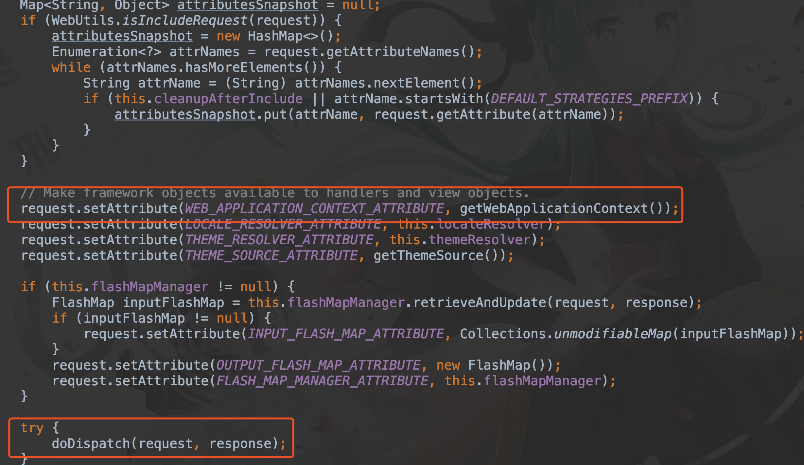
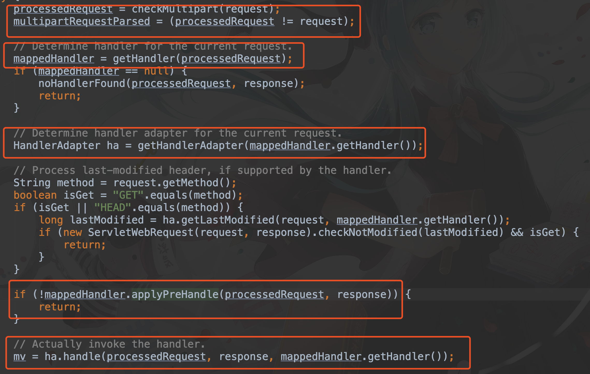

## SpringMVC源码阅读

学过 Spring 都知道需要在 web.xml 中配置一个 ``DispatcherServlet``，在 SpringBoot 中被自动配置了，但是这并不影响原理的运行。

如果有 Servlet 和 JSP 学习的历史，那么就会清楚，我们的自定义 Servlet 会继承 ``HttpServlet``，核心就是一个 ``service `` 方法，这个 service 就会唤醒我们覆写的 doGet 或者 doPost 方法。而 DispatcherServlet 也是如此，继承了 ``HttpServlet`` ，在 DispatcherServlet 中的 doService 也是如此

## 一、DispatcherServlet#doService

doService有三个功能

1. 配置 applicationContext
2. 添加各种各样的 attribute
3. **doDispatch**（核心）

## 二、DispatcherServlet#doDispatch

简单来说这就是我们平时写代码时最接近的核心

1. 检查是否是 multpart
2. 获取处理这个请求的 handler
3. 获取 handler 的 adapter
4. 在处理业务的一些前置钩子
5. 处理请求，呈现视图

