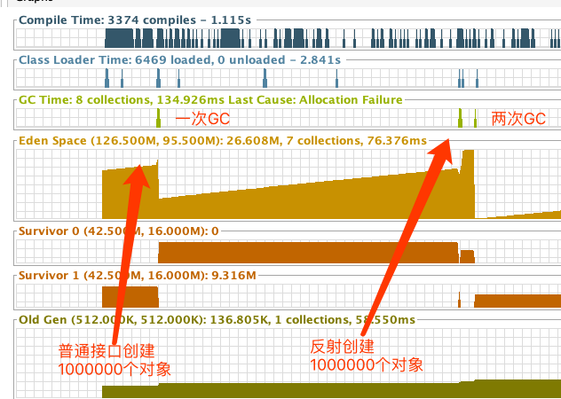

程序入口
```java
@Slf4j
@RestController
@SpringBootApplication
public class ReflectPerformanceApplication {

    public static void main(String[] args) {
        SpringApplication.run(ReflectPerformanceApplication.class, args);
    }

    @GetMapping("/case1")
    public String case1(@RequestParam(value = "times", defaultValue = "20") Integer times) {
        long start = System.currentTimeMillis();
        for (int i = 0; i < times; i++) {
            Task<String, String> task = new Task<>("普通创建对象", new MessaegHandler());
            task.addTaskNew();
        }
        long end = System.currentTimeMillis();
        log.info("创建 {} 个对象，普通消耗 {}", times, end - start);
        return "success";
    }

    @GetMapping("/case2")
    public String case2(@RequestParam(value = "times", defaultValue = "20") Integer times) {
        long start = System.currentTimeMillis();

        for (int i = 0; i < times; i++) {
            String CLASS_NAME = "com.draper.reflectperformance.reflectperformance.MessaegHandler";
            Task<String, String> task = new Task<>("反射创建对象", CLASS_NAME);
            task.addTaskReflect();
        }

        long end = System.currentTimeMillis();
        log.info("创建 {} 个对象，反射消耗 {}", times, end - start);
        return "success";
    }

}
```


为了方便观察，设置 JVM 参数

```
-Xmx128m -Xms128m -Xmn64m
```

运行程序，输出


```
 创建 1000000 个对象，普通消耗 29
 创建 1000000 个对象，反射消耗 2060
```

首先来说**反射的耗时是远远大于普通的方式**

其次查看 JVM 相应的数据如下




可见反射对象的创建不仅耗时更长，有一部分的原因在于对象创建的更多，从而导致了两次 STW。


## 二、思考

**上面的程序关于反射部分快速优化的地方**

缓存反射，直接 ``clazz.newInstance``


**除了上述优化，为什么使用反射会占用更多的性能？**

1. ``method.invoke`` 需要对参数数组进行包装
2. ``method.invoke`` 中需要对可见性进行检查


## 三、拓展

进入 method.invoke 方法

```java
public Object invoke(Object obj, Object... args)
    throws IllegalAccessException, IllegalArgumentException,
       InvocationTargetException
{
    if (!override) {
        if (!Reflection.quickCheckMemberAccess(clazz, modifiers)) {
            Class<?> caller = Reflection.getCallerClass();
            checkAccess(caller, clazz, obj, modifiers);
        }
    }
    MethodAccessor ma = methodAccessor;             // read volatile
    if (ma == null) {
        ma = acquireMethodAccessor();
    }
    return ma.invoke(obj, args);
}
```

可以看到有个 ``MethodAccessor`` 对象 ma 进行了真正的调用，而这个 MethodAccessor 是个借口，真正的实现是在 ``sun.reflect.ReflectionFactory#newMethodAccessor``

```java
public MethodAccessor newMethodAccessor(Method method) {  
  checkInitted();  
  if (noInflation) {  
    return new MethodAccessorGenerator().
      generateMethod(method.getDeclaringClass(),  
                     method.getName(),  
                     method.getParameterTypes(),  
                     method.getReturnType(),  
                     method.getExceptionTypes(),  
                     method.getModifiers());  
  } else {  
    NativeMethodAccessorImpl acc =  
      new NativeMethodAccessorImpl(method);  
    DelegatingMethodAccessorImpl res =  
      new DelegatingMethodAccessorImpl(acc);  
    acc.setParent(res);  
    return res;  
  }  
}  
```


在这里可以看到 MethodAccessor 的具体实现有两个版本。

* Java 版本，初始化时间较长，但长久来说性能好
* Native Code 版本，启动时较为快，但长久来说性能比不上 Java 版本

为了平衡性能，sun 的 JDK 使用了 ``inflation`` 技巧，让 Java 方法在被反射调用时，使用 Native，在若干次之后使用 Java 版本。


## 四、参考

[关于反射调用方法的一个log](https://www.iteye.com/blog/rednaxelafx-548536)


