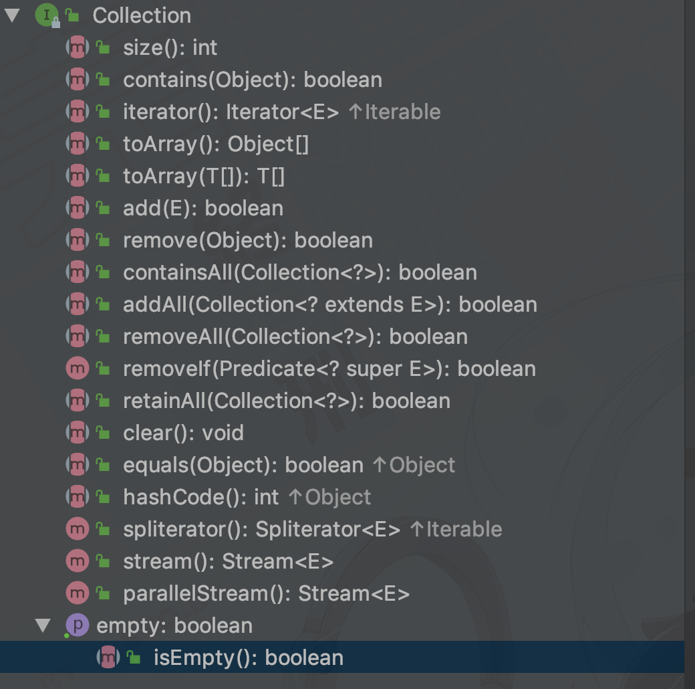
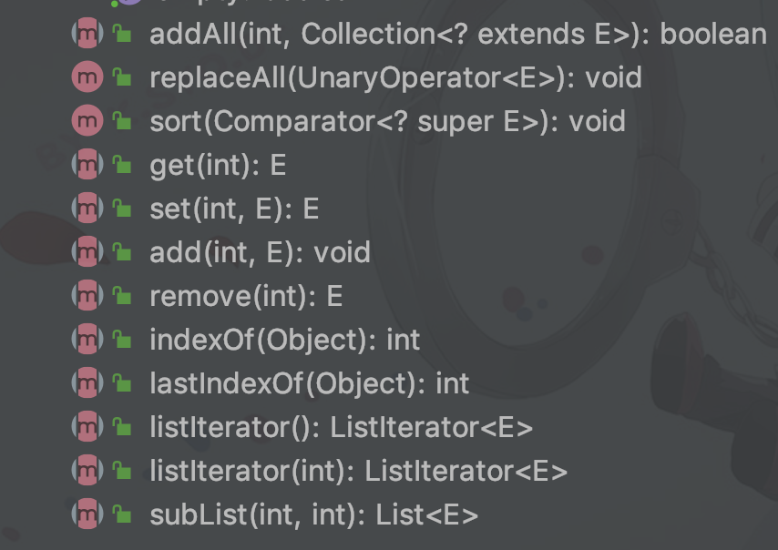
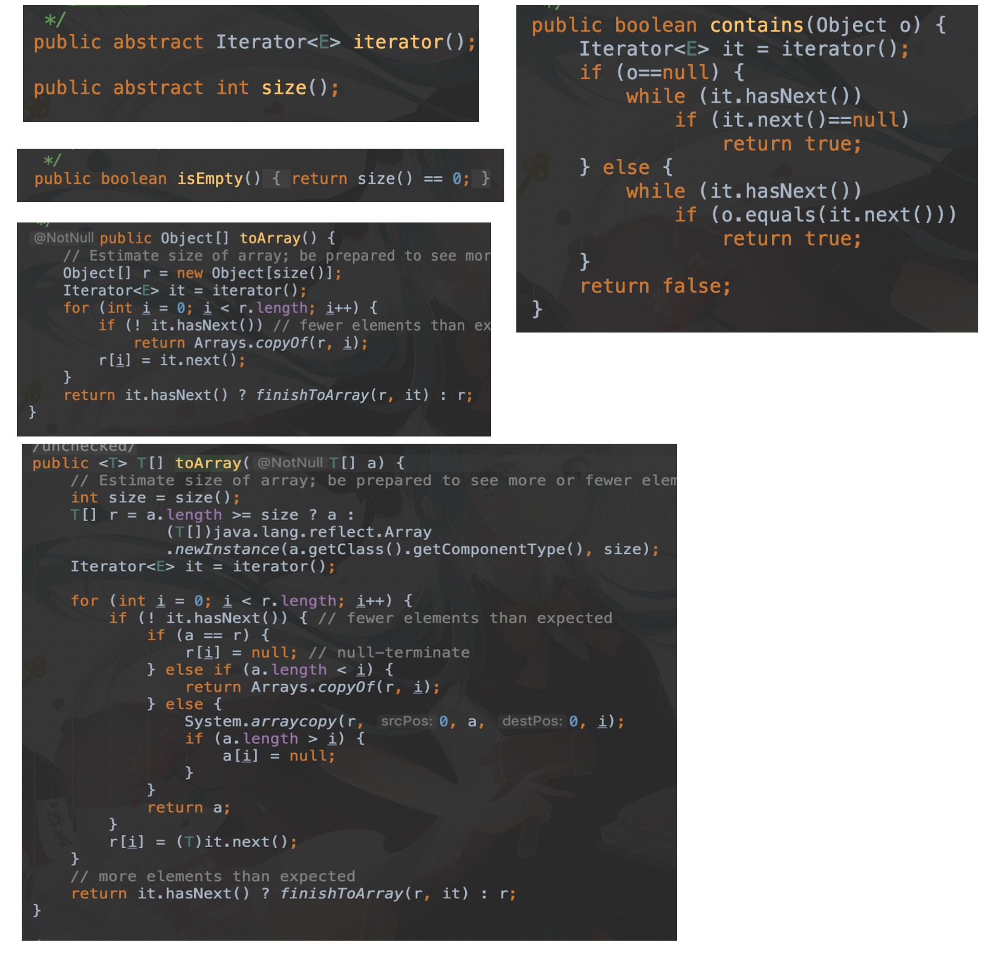
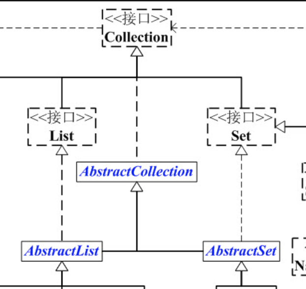
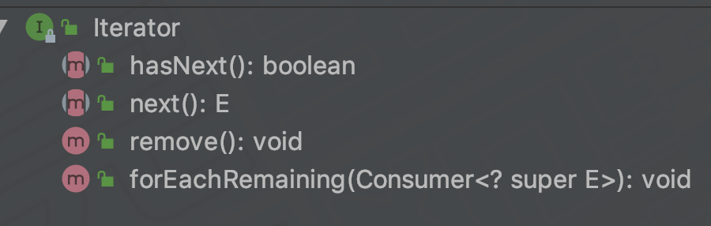

# Collection架构

Collection 有两个主要分支 List 和 Set

List 是有序队列，可以有重复的元素

Set 是数学上的概念，没有重复的元素

**Collection 是接口，用 AbstractCollection 实现了大多数 API** 


## 一、Collection 简介

**因为 Collection 是高度抽象的接口，包括的内容有集合的基本操作：添加、删除、清空、遍历、是否为空、获取大小、是否保护某元素**




## 二、List 简介

List 接口继承了 Collection 接口，List 是有序队列，每个元素都有一个索引。第一个索引为 0。

List 除了是一个 Collection 还有属于有序队列的特性




## 三、Set 简介

Set 更多的是数学上的概念，不能存储重复的元素。

Set 的方法基本与 Collection 相同


## 四、AbstractCollection

AbstractCollection 继承了 Collection 实现了大部分 Collection 方法，除了 ``Iterator()`` 和 ``size()`` 方法

主要目的是为了方便其他类实现 Collection。方便子类的快速实现。例如 ArrayList，LinkedArrayList。

仔细看源码



截图方法不全，但可以看到，这些方法实现的方式，就是通过 Iterator 和 size 来实现的。


## 五、AbstractList

```java
public abstract class AbstractList<E> extends AbstractCollection<E> implements List<E>
```





很容易看出来 AbstractList 要做什么，目的是为了提供一个 ArrayList 接口，使其子类可以快速实现 List。但同时又与 Collection 区分开。List 接口同样继承了 Collection 接口。但里面的实现方法，大多数又 AbstractCollection 实现了。


## 六、Iterator

Iterator 称为迭代器，用来迭代容器中的所有对象。也是我们常用的，




这个接口的结构也并不复杂。


## 七、总结

上面的提到的都是一个大概的轮廓，还有很多没有提到的，但是理解这个也是学习 OOP 的继承、接口的一种良好的方式。接口和抽象类搭建了 Java 集合重要的组成部分，骨架已经成型，剩下的都是细节的处理。


参考资料：

[Java 集合系列02之 Collection架构](https://www.cnblogs.com/skywang12345/p/3308513.html)


