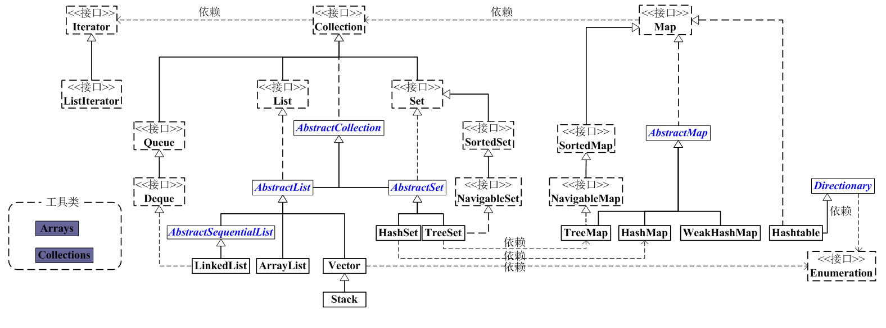

# 集合概览

Java 集合可以分为四个部分 ``List``、 ``Set``、``Map`` 还有各种各样的工具类（``Iterator``、``Enumeration``、``Arrays``、``Collections``）

抓住主干来阅读，主要有两个部分 ``Collection``和``Map``

## 一、Collection

Collection 是一个接口，高度抽象的集合，包含集合的基本操作。

有两大分支，``List`` 和 ``Set``

### 1. List 是一个有序的队列，每一个元素都有索引

底层的实现有 ``LinkedList``、``ArrayList``、``Vector``、``Stack``

### 2. Set 是一个不允许有重复元素的集合

底层的实现有 ``HashSet``、``TreeSet``。HashSet 又依赖 ``HashMap``。TreeSet 又依赖 ``TreeMap``。

## 二、Map

### 1. Map 是一个映射接口，即 ``key-value``

``AbstractMap`` 是一个抽象类，实现了 Map 接口中大部分 API。而 HashMap、TreeMap、WeakHashMap 都是继承 AbstractMap

### 2. Hashtable 虽然继承了了 ``Directionary``，但也实现了 Map 接口

## 三、其他工具

### 1. Enumeration，作用于 Iterator 一样，用来遍历集合。但功能比 Iterator 少得多

### 2. Collections 和 Arrays 是用来操作集合的工具

参考资料

[Java 集合系列01之 总体框架](https://www.cnblogs.com/skywang12345/p/3308498.html)

