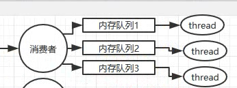

## Q: 如何保证消息不被重复消费（如何保证消息消费的幂等性）？

> 

> kafka 消息 offset 批量提交，导致重复消费，从而导致业务在 DB 中重复插入两次

 A: 使用一套幂等性保障机制

### CASE1

可以往内存 Set 存放 id = 1 这样的数据，如果有重复的数据，去内存 Set 里检查，这个消息是否存在：有意味着已经被处理了，丢弃消息。如果没有，再进行操作

### CASE2

基于数据库的唯一键，确保不会处理重复的数据，导致脏数据。

## Q: 如何保证消息的可靠性传输（如何处理消息丢失问题）？

丢失消息的地方

1. 生产者到 MQ 因网络等问题，丢失消息
2. MQ 挂了，内存中的消息丢失
3. 消费者收到消息，但在处理时消息挂了，但 MQ 认为已经消费完成，但实际上消息丢了

以上面的三个过程分别解决

1. 

CASE1: 开启事务，try catch 同步机制，效率低

CASE2: 类 Rabbit 的回调机制，可以保证的是消息吞吐量比较高

2. 

CASE1: RabbitMQ 持久化元数据至磁盘，仍然可能持久化途中挂了，导致消息丢失（概率较低）

3. 

CASE1: 像AUTOCOMMIT会导致消息丢失，关闭 AUTOACK，手动 ACK

## Q: 如何保证消息的顺序性

不论是 MQ 还是线程，都会导致消息的顺序性错乱

可以使用多个内存队列来保证

假设消息1，消息2，消息3 都是同一个业务，再假设有一个订单 id，则将 消息的订单 id hash 后分发到内存队列中，同一个业务的消息则会在一个队列中，且会保持顺序，此时再用单线程去处理也能保持消息的顺序性

## Q: 消息积压过期失效怎么办？队列满了怎么处理？几百万消息积压几个小时，怎么解决？

### Q: 消息队列几百万消息如何快速消费

CASE1: 紧急扩容，用多几个消费者去将请求转发到其他的 MQ，用更多的消费者进行消费

**RabbitMQ 可以做到过期丢弃？**

CASE2: 遇到消息积压，且过期丢弃，属于事故。比如消息队列中 10000 个订单，有 1000 个丢失，需要迅速手动从数据库单开程序进行补单。

CASE3: 实在不行，对于消息队列快满，且消息积压，可能丢失。这个时候丢失属于小事故，消息队列占用磁盘过满，面临磁盘崩溃，首先一个任务是写一个临时，对消息队列中的消息进行消费，但是并不做真正的处理，直接丢弃，先把 MQ 中的空间空出来，等到了晚上，在写一个程序对消息队列中数据补数据。

## Q: 如果设计一个消息队列中间件的框架，你会怎么做？

主要考察对消息队列的理解和领悟

比如说分布式的消息队列。

1. MQ 支持扩容，那就支持分布式，参照 kafka 的设计，每个 broker 是一个集群上面的节点，一个 topic 可以拆成多个 partition，每个 partition 放一个及其，存一部分数据，如果资源不够了，可以增加 partition，然后做数据迁移

2. 持久或，顺序写，去除随机读取写的磁盘消耗
3. 高可用
4. 0 丢失

