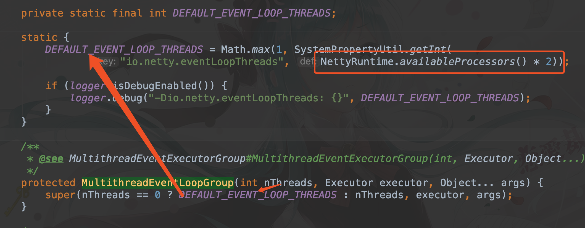

# EventLoopGroup


## 一、实例化

```java
EventLoopGroup group = new NioEventLoopGroup();
```

通常我们创建的方式特别简单，但查看初始化的细节，会发现 ``NioEventLoopGroup`` 构造函数有很多嵌套，直到 ``io.netty.channel.MultithreadEventLoopGroup#MultithreadEventLoopGroup(...)`` 这个方法，会发现，**当没有指定线程数的时候，会给一个默认的线程数，为 CPU 核心数 * 2**。



