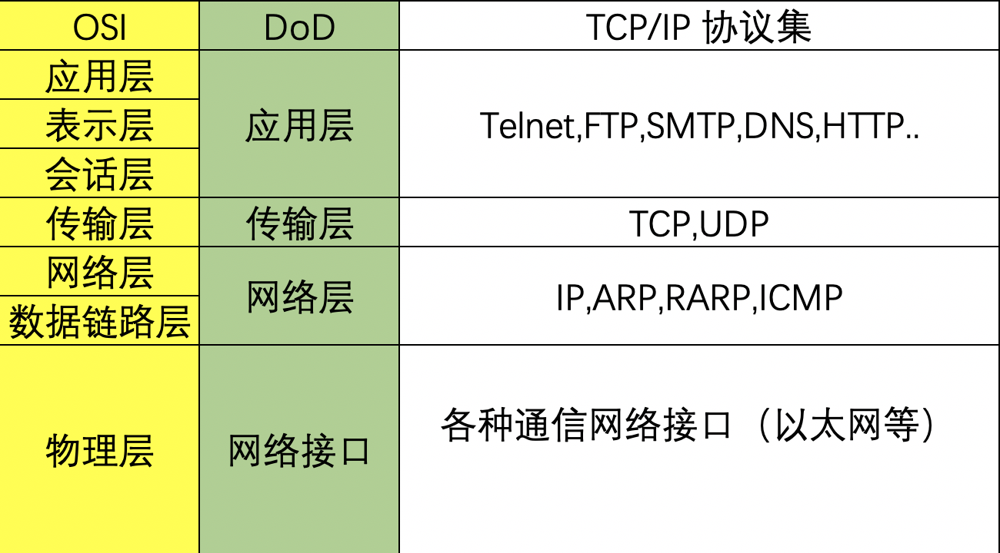

# TCP/UDP

## 一、简介

先看下网络分层，TCP/IP 协议中，传输层给应用层提供服务。

## 二、TCP/UDP

网络层只包含两个协议：TCP/UDP

TCP ：可靠性传输，面向连接，提供差错检测

UDP：不可靠传输，无连接

### 1. UDP 协议

**主要特点：**

1. 无连接，发送之前不需要建立连接，一般一个数据包就能完成的通信使用 UDP。例如，请求 CDN 解析网址。
2. 最大努力交付。不保证可靠交付，不使用拥塞截止。
3. 面向报文。适合多媒体通信的要求。适合于多播通信。
4. 支持一对一，一对多，多对一，多对多的交互通信。
5. 首部开销小，只有 8 字节

### 2. TCP 协议

**主要特点：**

1. 面向连接。
2. 只能点对点的通信。
3. 提供可靠交付的服务。
4. 实现拥塞控制功能。
5. 实现流量控制的功能。
6. 面向字节流传输

参考资料

[计算机网络 - 传输层(TCP/UDP层)](https://juejin.im/post/5d731dbf5188255457502794?utm_source=gold_browser_extension)