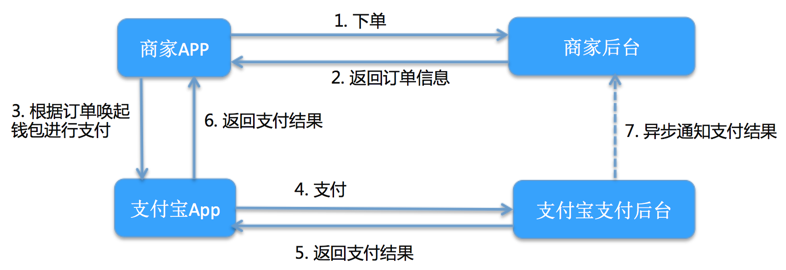

# 做支付需要考虑什么

支付围绕着业务不同的定位从而有不同的阶段

第一阶段：作为一个封闭的、独立的应用系统，为各系统提供支付功能的支持。

第二阶段：支付作为一个开发的系统，为公司内外部系统、各种业务提供支付服务，支付服务本真应该是和具体的业务解耦合

## 支付系统的功能

* 支付/支付查询/取消支付
* 退款/退款查询

- [ ]  一张订单包含的要素(生成订单需要什么数据)
- [ ] 
- [ ] 对于 returnUrl quitUrl notifyUrl 的需要(存储地方)

如果我做支付，我会考虑什么，作为一个初级程序员，我能想到的也没有太多，都是些基础的知识。例如全局 Id

全局 Id，全局 Id 就是订单 Id，这个订单 Id 在分布式情况下，为了保证不会被重复消费，全局 Id 的考虑特性需要再备份，但是在单机情况下就很小了。目前最主要的两个功能 支付、退款，其他的后面再说。

## 支付

支付中，一个订单在服务端生成的要素。

