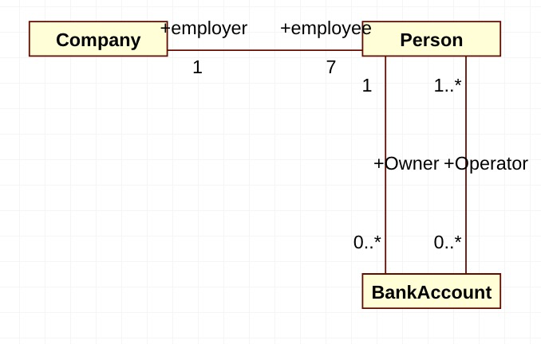

# OOA、OOD

#### 本文的内容

主要包含五个部分

1. 面向对象分析 OO analysis
2. 面向对象设计 OO design
3. 设计模式 design pattern
4. 统一建模语言 the Unified Modeling Language (UML)
5. 面向对象编程 OO programming

Ability is what you're capable of doing. Motivation determines what you do. Attitude determines how well you do it.

#### 推荐书籍

UML 和模式应用 —— 思想、技巧与实践

面向对象葵花宝典

The Object-Oriented Thought Process

你的灯还亮着么

程序员思维修炼

黑客与画家

奇思妙想，15位计算机天才及其重大发现 

**所有对事物的认识都始自于我们不愿盲目地接受这个世界**

## What is a Class、Object?

A class is a description of a set of objects that share the same attributes, operations, relationships, and semantics

An object is an Instance created from a class.

**Everything is an object**

## Object-oriented Thinking

软件工程是与人打交道、为人提供服务的

对于想成为**问题解决者**的人来说，郁闷的关键是"把单一思维模式切换成对哦冲思维结构"

软件系统是由多个对象组成，对象间通过消息相互交流、共同协作、以完成整个系统的功能

### 定义

在对世界/系统 进行 观察/建模的时候，把它们看成一些列相互交流、互为影响的对象集(a set of objects)

有两点含义：

1. 世界是相互作用的对象组成

2. 描述与构建由对象组成的系统

### 面向对象与面向过程

* 面向对象：解决不确定的事件、创新型的事件

* 面向过程：处理已知的事实、重要的条件都已知的场景

比较

* 面向过程侧重于考虑方法的编写，**重点在于如何传递数据**
* 面向对象致力于将数据和方法做一个封装，**除数据之外还有对数据处理的方法**

### OO 思考方式的核心特征

* 封装 Encapsulation
* 继承 Inheritance
* 多态 Polymorphism
* 聚合/组合 Aggregation / Composition
* 接口/实现 Interface / Implementation
* 抽象 Abstraction

#### Encapsulation

is the process of hiding the imlementation details of an object

The internal state is usually not accessible by other objects

The only access to manipulate the object data is through its interface 

##### Rule

An object should only reveal the interfaces needed to interact with it. Details not pertinent to the use of the object should be hidden from other objects

##### Suggestion

Getters and Setters

#### Inheritance

##### Polymorphism

简单说就是有多重形态

* 当一个类从另一个类继承而来，多态可以使得子类代替父类
* 详细发送方不需要知道消息接收方属于哪个类子类
* 同一**类族**的接受者可以按自己的方式处理消息

指向父类的指针可以调用子类的对象

#### 聚合/组合 Aggregation / Composition

平时在说继承是 ``is-a`` 关系

例如吉普车是车，车是交通工具，这就可以用继承

聚合就是 ``has-a`` 关系，组合是聚合的一个变种

一个对象包含着其他的几个对象

例如汽车包含着发动机，轮胎等

**组合更强调部分对象仅存在于整体对象之中，整体控制部分的生命周期**

#### 接口/实现 Interface / Implementation

接口就是描述一个类的用户如何与这个类交互

实现就是完成接口所定义的功能，如类、构件等完成的任务

例如一个 TV，电源插座，发电厂之间的关系

> 试了好几个 UML 软件，最后选择了 StarUML

#### 抽象 Abstraction

抽象表示一个对象与其他所有兑现相区别的基本特征，因此提供了同观察者角度有关的清晰定义的概念界限，抽取出共同特征(比较像的特点)即使抽象

客观世界的事物都由各种各样的实体(对象)构成

每个对象都有各自的内部状态和运动(状态)规律

根据对象的属性和运动规律的相似性可以将对象分类

## 建模

把不太理解的东一和一些比较了解东西，十分相似的东西作比较，可以对这些不太理解的东西产生更深刻的理解，叫做建模

#### 为什么要建模

1. 帮助我们按照需要对系统进行**可视化**
2. 允许我们详细**说明系统的结构和行为**
3. 给出一个指导我们的**构造系统**的模板
4. 对我们所做出的决策进行**文档化** 

#### 建模的四项基本原理

1. 选择要创建什么模型
2. 每一种模型可以在不同的精度级别上表示
3. 最好的模型是与现实相关的
4. 单个模型是不充分的，对每一个重要的系统最好用一组几乎独立的模型去处理

#### UML: Unified Modeling Language

UML 结构构造如下

UML 还有一些公共机制

* 相述
* **修饰**
* 通用划分
* 扩展机制
  * **构造型**
  * 标记值
  * 约束

常用的四种关系

* 关联关系
* 实现关系
* 依赖关系
* 继承关系

---

对于 UML 中的符号特别多，以及一些高级符号，且在 UML 的各个版本略有不同，看需而定

#### 用例模型

用来完成需求分析，避免最后实现的功能不是想要的 (╯-_-)╯~╩╩

用例图包含以下五个组件

1. 参与者
2. 边界
3. 用例
4. 关系
5. 用例描述

##### 参与者 Actor

标识系统之外并进行交互的一类事务(人、物、其他软件子系统等)

通过它，可以对软件系统与外界发生的交互尽心分析和描述

通过它，可以了解客户希望软件系统提供的哪些功能

Actor 的图形标识

可以根据下面的问题来寻找系统的参与者

1. 谁使用系统？
2. 谁安装、维护系统？
3. 谁启动、关闭系统？
4. 谁从系统这获取信息，谁提供信息给系统？
5. 在系统交互中，谁扮演了什么角色？
6. 系统会与其他系统相关联？
7. 内/外部定时器。

> 手机软件系统的 Actor 有
>
> * 用户
> * 网络
> * SIM 卡
>
> 学院管理系统的 Actor 有
>
> * 用户、学生、教师、系统管理员
>
> * 数据库
>
> * 如果有子系统
>
>   * 其他系统可以作为一个 Actor
>   * 有时数据库可以作为一个 Actor
>
> 银行 ATM 的 Actor 有
>
> * 用户、管理员
> * 网络、数据库

##### 用例

系统作为相应参与者引发的一个事件而执行的一系列的处理、动作、而处理应该为参与者产生一种有价值的结果

这些动作

* 不但应包含**正常情况**的各种动作序列
* 而且应包含**非正常情况**时软件系统的动作序列的描述。 Exception / Alternate

中间的椭圆就是对用例

如何寻找用例

1. 参与者希望系统提供什么功能
2. 系统是否存储和检索信息
3. 当系统改变时，是否通知参与者
4. 是否存在系统的外部事件，是哪个参与者通知系统这些外部事件
5. 那个参与者触发了活动

##### 关系

用例图中的关系

1. 参与者与用例之间
   * 关联关系：用实线表示
2. 参与者/参与者之间的关系
   * 泛化关系：实线 + 空心箭头
3. 用例之间的关系
   * 泛化关系：例如，发出订单 - 网上发出订单 。*同一个功能*
   * **包含关系：《include》**。*必须包含的功能*
   * **拓展关系：《extend》**。*额外的功能*

##### 用例描述

| Section title  | Section Content                                              |
| -------------- | ------------------------------------------------------------ |
| Summary        | Give the role, purpose and the summary of the use case.      |
| Actor List     | List the actor involved in the use case.                     |
| Pre-condition  | Give the conditions that must be filled to activate the use case. |
| Description    | Detail operations performed during the use case.             |
| Post-condition | Give the modified states of the system, modified resources, etc. |
| Exception      | Give the possible errors or exceptions that must be taken into account during the use case execution. |

用例模型小结

* 是软件开发人员分析客户业务流程的结果
* 是面向对象分析的结果
  * 不一定完全面向对象分析的结果
* 是面向对象设计的输入
* 是开发部门与顾客之间的合同
* 是软件设计部门与软件工程师之间的合同
* 是开发部门领导，非直接开发人员了解系统信息的主要来源

---

#### 活动图

表示了在一个过程中，顺序的并行的**活动**及其之间的关系，主要是为了需求分析

活动图是**顶点**和**弧**的集合

* 活动节点
* 动作
* 流
* 对象值
* 注解和约束等

注意同步棒可以跨泳道，活动不可以跨泳道

#### 类图

具有相同属性，操作，方法，关系或者行为的一组对象的描述符

类是真实世界事物的抽象

##### 关联

讲师和课程之间有老师作为关联

一到N 个讲师可以有0到N个课程

一个雇主有7个员工

1个员工拥有7个账户

1个员工操作7个账户

##### 组合和聚合

* 聚合，"整体" 有管理 "部分" 的特有职责，他用端点带有空菱形的线段表示，空菱形与 "整体" 类相连
* 组合，"整体" 拥有 "部分" 的生命，他用端点带有实菱形的线段表示，实菱形与 "整体" 类相连接，每个部分表示的类与表示整体的类之间有单独的关联，单位了方便起见，连线结合在一起

有时候用线段无法表示，所以还会用的关联类

一个学校由多个部门组合，学校没了，部门就没了

0..1 个部门可以有 0..1个领导，部门是由老师聚合的，部门没了，老师还要继续找工作的

一个老师可以教多个课程，一个系(部门)有多个课程，学生可以出席多个课程

类是面向对象分析设计的核心概念，使用工具去表示其相关概念很重要

**最重要的是我们如何去发现，去思考，去定义类之间的关系，定义每个类该承担的职责。**

---

接下来说的几个跟交互有关

#### 顺序图(时序图)

是软件设计的强大工具

是一种动态视图

##### 顺序图的建模元素

* 对象或原色
* 参与者
* 消息

##### 交互图

* 交互的过程表现出来，就是交互图
* 顺序图、通信图，都是交互图

交互的基本概念 — 消息

* 同步消息 上图 1.11 同步消息
* 异步消息 上图 1.7 异步消息

这一部分主要看上面的图就比较容易理解

##### 顺序图小结

* 顺序图可以动态验证类模型的可行性
* 顺序验证的某一功能，属于某个用例描述的功能的一部分
* 顺序图从上到下，反映了对象相互协作的时间顺序

