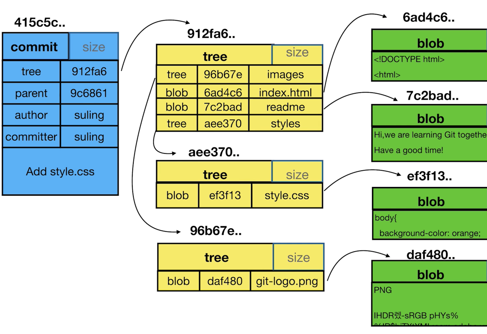

##.git 目录


``.git`` 目录

* ``HEAD`` 我们正在工作的分支

* ``config`` 我们的配置

  ```bash
  ➜  .git git:(83f6993) cat config
  [core]
  	repositoryformatversion = 0
  	filemode = true
  	bare = false
  	logallrefupdates = true
  	ignorecase = true
  	precomposeunicode = true
  [remote "origin"]
  	url = https://github.com/draperstudio/itoken-sso.git
  	fetch = +refs/heads/*:refs/remotes/origin/*
  [branch "master"]
  	remote = origin
  	merge = refs/heads/master
  ```

* ``refs``

  * ``heads`` 分支

    ```bash
    ➜  refs git:(83f6993) ll heads
    total 24
    -rw-r--r--  1 draper  staff    41B  3 27 22:13 dev_eureka
    -rw-r--r--  1 draper  staff    41B  3 27 17:45 dev_nacos
    -rw-r--r--  1 draper  staff    41B  3 29 00:14 master
    ```

    ```bash
    ➜  .git git:(83f6993) cat refs/heads/master
    83f699392e3233974d8cec2eeda0c43f8011de14
    ```

    

  * ``tags`` 里程碑，发行的版本，标签等

    ```bash
    ➜  .git git:(83f6993) cat refs/tags/temp
    83f699392e3233974d8cec2eeda0c43f8011de14
    ```

    

* ``objects`` 核心目录文件

  ```bash
  ➜  objects git:(83f6993) ll
  total 0
  drwxr-xr-x  3 draper  staff    96B  3 25 22:37 00
  drwxr-xr-x  3 draper  staff    96B  3 26 21:36 01
  drwxr-xr-x  4 draper  staff   128B  3 29 21:45 04
  drwxr-xr-x  3 draper  staff    96B  3 29 21:41 05
  drwxr-xr-x  4 draper  staff   128B  3 26 21:39 06
  drwxr-xr-x  3 draper  staff    96B  3 29 21:06 07
  ➜  objects git:(83f6993) cd 07
  ➜  07 git:(83f6993) ll
  total 8
  -r--r--r--  1 draper  staff   117B  3 29 21:06 96a4921f7235a201ddf24a233540a084853a3a
  ➜  07 git:(83f6993) git cat-file -t 0796a4921f7235a201ddf24a233540a084853a3a
  blob
  ➜  07 git:(83f6993) git cat-file -p 0796a4921f7235a201ddf24a233540a084853a3a
  package com.draper.itoken.sso.common.service.impl;
  
  /**
   * @author draper_hxy
   */
  public class RedisServiceImpl {
  }
  ```

  * tree
  * commit
  * blob


### 常用命令

```bash
git config --local --list # 获取本地配置
```

```bash
git config --local user.name 'draper_hxy' # 修改指定配置
```

```bash
git branch -av
```

```bash
git cat-file -t  # 查看引用类型
```

```bash
➜  .git git:(83f6993) git cat-file -t 83f6993
commit
```

```bash
➜  tags git:(83f6993) git cat-file -p 83f6993
tree 93826838bfbb4eab7dd74d5be5b6f5a3e1238c4b
parent 16ab54691643ad60591383ad98c83c9718e661f4
author Draper_HXY <draper_hxy@163.com> 1553789672 +0800
committer Draper_HXY <draper_hxy@163.com> 1553789672 +0800
```


## commit、tree、blob 对象



一个 commit 对应着一个 tree，一个 tree，这个 tree 有着许多的 blob，即文件。


## 修改 commit message

#### 修改最新的 commit

```bash
git commit --amend
```

#### 修改老旧的 commit message

```bash
git rebase -i # rebase 变基操作，交互式
reword
```


## 将连续的几个 commit 合成一个 commit

```bash
git rebase -i
squash
```


## Tag

```bash
git tag -d dev # 删除 tag
```


### 删除远程分支

```bash
git push origin --delete dev_draper
```

