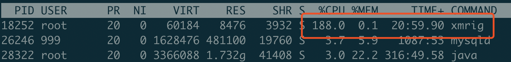
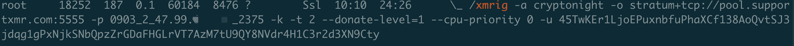
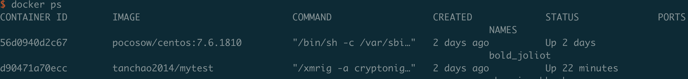

# 是谁在用我的阿里云挖矿！

## 一、问题发现

突然有天阿里云给我发了条信息

emmm，我就想知道，是哪个大神相中了我的服务器...这服务器又破又小，承载不起你的厚爱。所以开始排查

先上阿里云看了下漏洞报告

## 二、问题排查

在远程看了下，一阵心疼

PS 看了下执行命令，注意到 2375 端口，通常这个端口给 docker 开放的

使用 docker ps

可以看到明显有两个容器在运行

## 三、清除木马

使用 docker stop rm 之类的命令，把 xmrig 相关的容器全部清除。

把 docker 2375 端口外网关闭，docker 的远程访问不开启授权，那么安全性是相当低的

然后再查看系统就恢复正常了。没有想象中的会有什么定时任务之类的反复重启，应该是木马留面子了，没有进行更具有危害性的操作。

## 四、SSH

再看阿里云之前给我报过几个异地登录的情况，我没有注意，顺便把 SSH 密码改了

