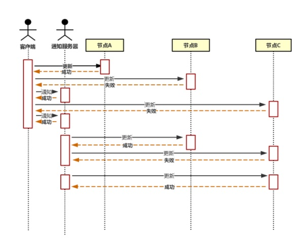

# 刚性事务和柔性事务

## 一、柔性事务

之前了解的传统事务，就是强一致性，2PC 和 3PC 中，也是要求强一致性(只是做不到..)，在CAP 中的一致性，指的也是强一致性。所以不单独解释强一致性是什么，就是绝对的 ACID

---

在 CAP 中，**Partition tolerance 是我们必须的选择**，所以 CA 中必有一个会被我们舍弃

**在 BASE 理论中，可以通过暂时牺牲强一致性来提高可用性**，所以就有了柔性事务的概念

**即使无法做到强一致性，但每个应用，应该通过自身业务的特点来做到最终一致性**

所以说，对业务来讲会有比较强的侵入性。

## 二、柔性事务的实现

### 1. 补偿型

在普通的分布式事务中，A 和 B 两个事务彼此具有较强的一致性。当 A 失败，B 就失败，A 成功， B 就成功。且在事务执行中，AB 两者的资源时刻处于锁定状态。这种模型会造成堵塞，且最后失败了全都会回滚，可谓是吃力不讨好。

WS-BusinessActivity提供了一种基于补偿的long-running的事务处理模型。可以解决这种情况

还是上面的模型，当 A 提交成功后，释放 A 的资源。B 进行提交，提交成功，事务结束。若提交失败了，B 进行回滚。但此时 A 已经提交了。无法进行回滚。这就意味着我们需要**对 A 进行一个补偿的操作**，例如 A 原本的事务是订单+1，所以这个补偿操作是订单 -1，库存，余额也是如此。故**补偿型事务的实现会对业务造成一个较强的侵入性**，**且要时刻把握住对业务的理解**，要求是比较高的。

### 2. 异步确保型

将一些同步操作变成异步操作，避免对数据库事务的争用。比如热点资源批量更新等..

### 3. 最大努力型

## 三、总结

**柔性事务就是牺牲了一致性，来达到局部可用，基本可用**，这也是现在通常的解决方案，有很多具体的技术选型中，很多东西都是上面模型的变形，例如在最大努力型中，通知服务器可以是 redis，可以是 MQ，甚至是数据库(子节点主动去查询，看看是否有属于自己的通知)，要灵活边用

参考资料
[分布式事务：从刚性事务到柔性事务](<https://zhuanlan.zhihu.com/p/35842287>)

